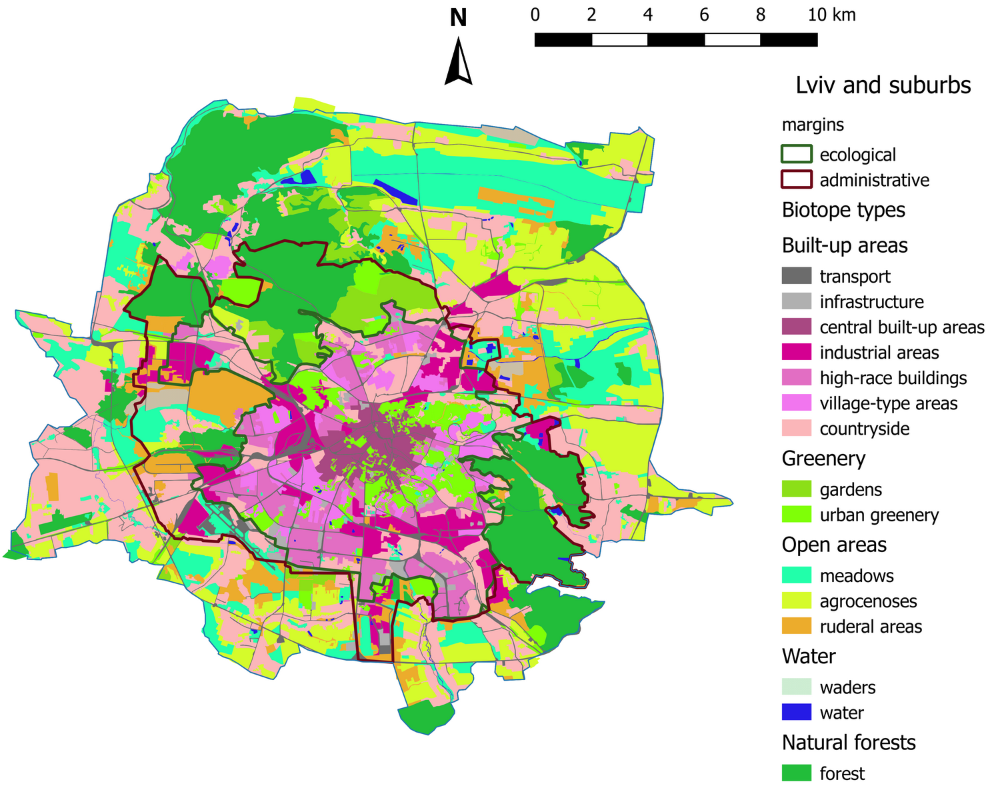

# Атлас біотопів (середовищ) міста Львова 2020  Atlas of habitats (biotopes) in Lviv, Ukraine, as of 2020

Олексій Дубовик | Oleksii Dubovyk

*Кафедра зоології, Львівський національний університет імені Івана Франка (на момент виконання роботи)*

*Zoology department, Ivan Franko National University of Lviv (at the time)*

📧 *oadubovyk@gmail.com*

## Огляд

Картування типів середовища відбувалося протягом 2019--2020 рр. на основі супутникових знімків Google Earth. Територія міста Львів та околиць була поділена на 470 1х1-км квадратів, кожен із яких був візуально поділений на полігони, що репрезентують різні типи середовища. Нижче наведено приблизний результат ручної класифікації.

## Набір даних

Набір даних зберігається в теці [/lviv-habitats](/lviv-habitats) у форматі ESRI shapefile, GeoPackage, та csv.

CRS EPSG:4326.

Кожен полігон містить наступні атрибути:

- fid - feature ID (всього 5516)
- habitat type - тип середовища
- area_km2 - площа полігона в квадратних кілометрах

## Типи середовища

### Забудова

#### `tran` --- Транспортна інфаструктура

#### `infr` --- Цивільна інфраструктура

#### `bcen` --- Щільна центральна житлова забудова

#### `bind` --- Індустріальна забудова

#### `bhig` --- Багатоповерхова житлова забудова

#### `bvil` --- Вілова житлова забудова

#### `brur` --- Сільська житлова забудова

### Озеленення 

#### `gard` --- Сади

#### `gree` --- Парки

#### `ceme` --- Кладовища

### Відкриті площі

#### `mead` --- Луки

#### `agro` --- Агроценози

#### `rude` --- Рудеральні ділянки

### Водно-болотні угіддя

#### `wade` -- Заболочені ділянки

#### `wate` --- Відерита вода

### Природні ліси

#### `fore` --- Ліси

