# Атлас біотопів (середовищ) міста Львова 2020  Atlas of habitats (biotopes) in Lviv, Ukraine, as of 2020

Олексій Дубовик | Oleksii Dubovyk

*Кафедра зоології, Львівський національний університет імені Івана Франка (на момент виконання роботи)*

*Zoology department, Ivan Franko National University of Lviv (at the time)*

📧 *oadubovyk@gmail.com*

## Огляд

Картування типів середовища відбувалося протягом 2019--2020 рр. на основі супутникових знімків Google Earth. Територія міста Львів та околиць була поділена на 470 1х1-км квадратів, кожен із яких був візуально поділений на полігони, що репрезентують різні типи середовища. Нижче наведено приблизний результат ручної класифікації.

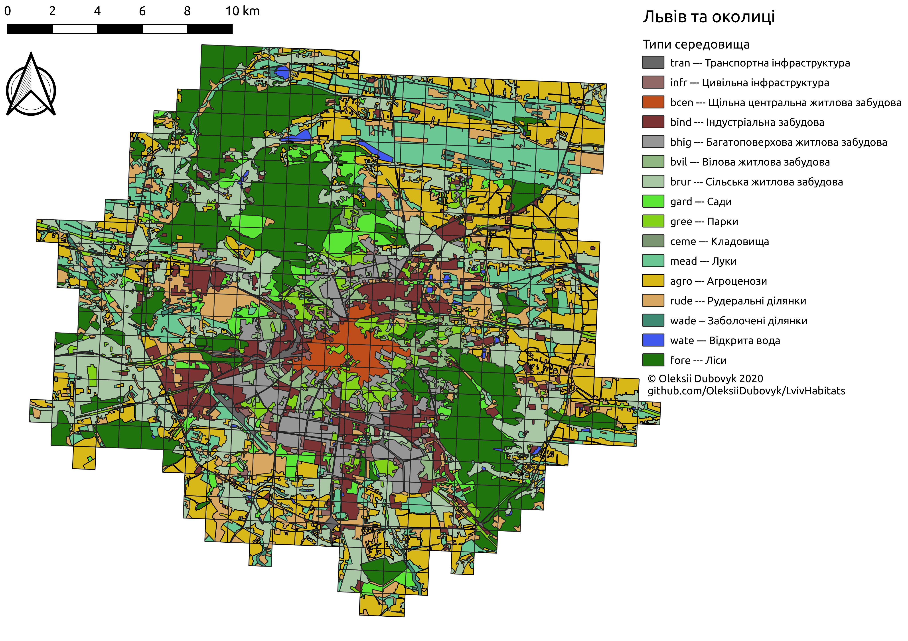

## Набір даних

Набір даних зберігається в теці [/lviv-habitats](/lviv-habitats) у форматі ESRI shapefile, GeoPackage, та csv. Стилі в окремій теці можуть бути використані в QGIS.

CRS EPSG:4326.

Кожен полігон містить наступні атрибути:

- fid - feature ID (всього 5516)
- habitat type - тип середовища
- area_km2 - площа полігона в квадратних кілометрах

## Типи середовища

### Забудова

#### `tran` --- Транспортна інфраструктура

Головні дороги, залізниця, значні площі асфальту чи бетонного покриття.

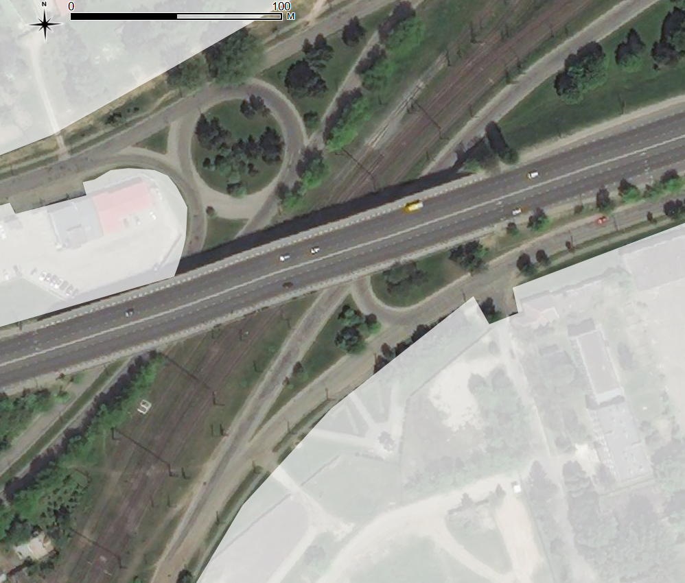

#### `infr` --- Цивільна інфраструктура

Гаражні кооперативи, ринки тощо.

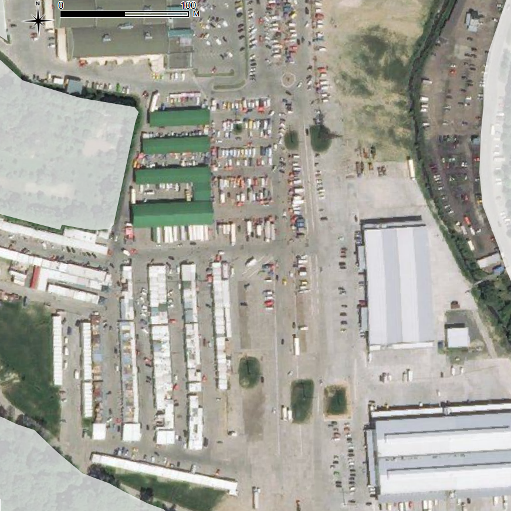

#### `bcen` --- Щільна центральна житлова забудова

Щільна забудова із декількома поверхами, притаманна історичній частині міста.

#### `bind` --- Індустріальна забудова

Склади, діючі індустріальні комплекси із очікуваним помітним шумовим забрудненням.

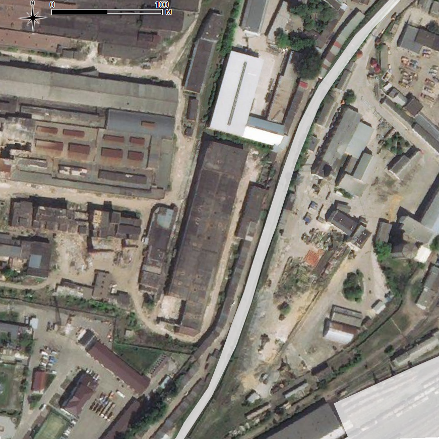

#### `bhig` --- Багатоповерхова житлова забудова

Типові спальні райони із помітним рівнем озеленення.

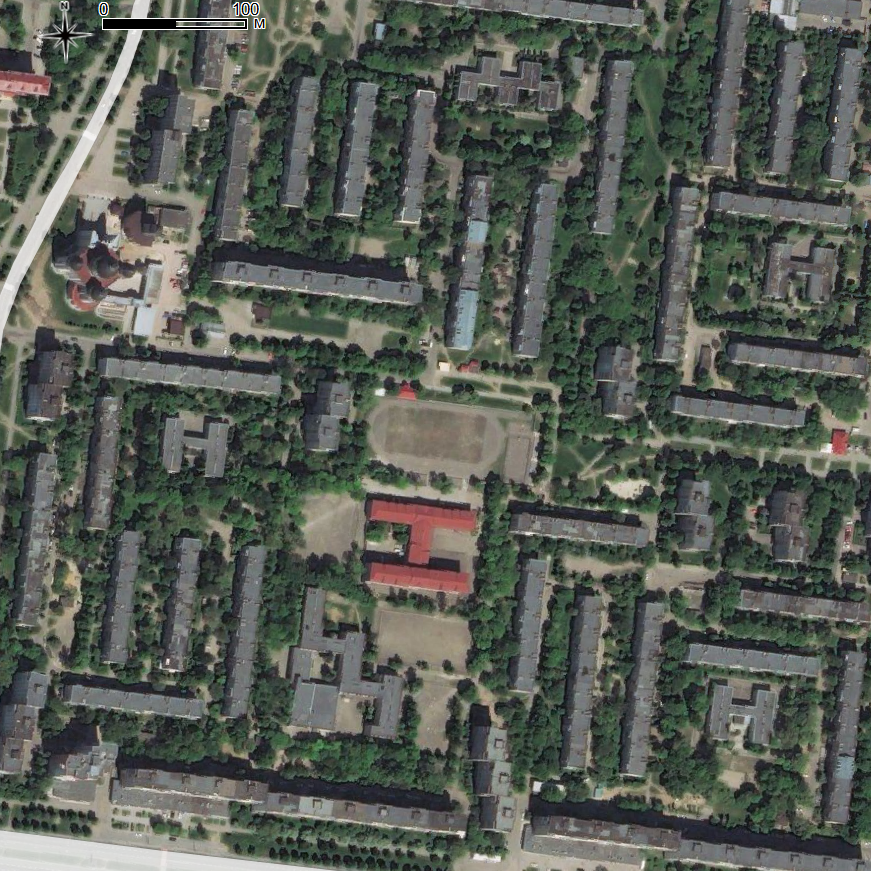

#### `bvil` --- Вілова житлова забудова

Одно- та дво-поверхова забудова із помітним рівнем озеленення.

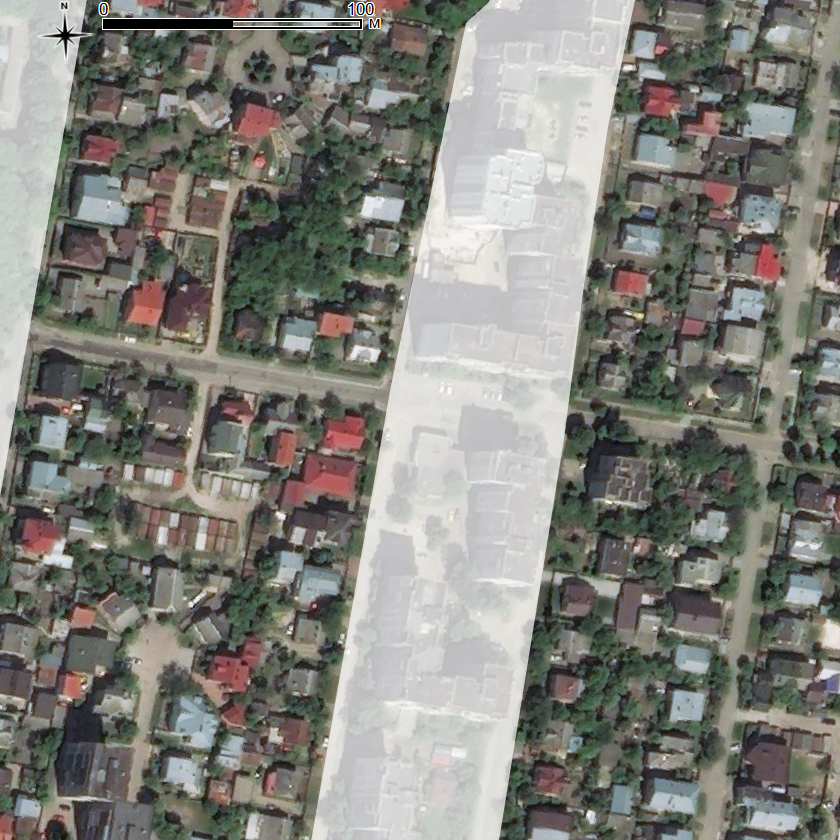

#### `brur` --- Сільська житлова забудова

Щільні земельні ділянки із одно- та дво-поверховою забудовою та значним рівнем озеленення, притаманні селам.

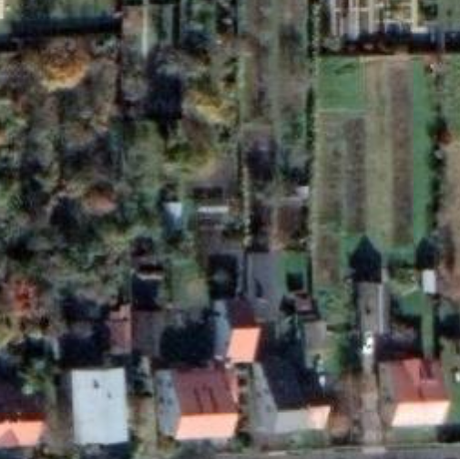

### Озеленення 

#### `gard` --- Сади

Насадження середньої щільності із, переважно, низькими чи молодими деревами, подекуди із напівзанедбаними господарськими будівлями.

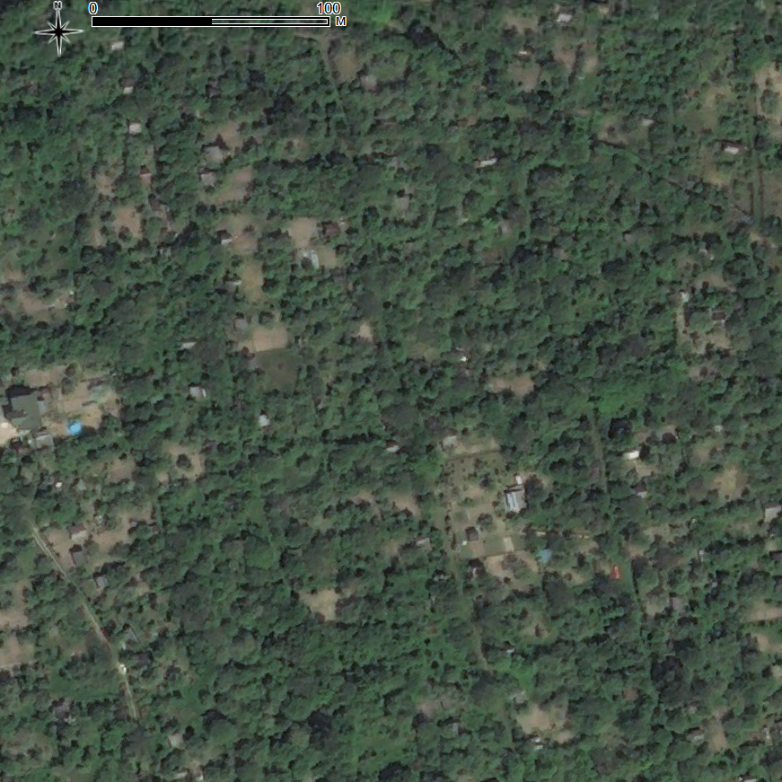

#### `gree` --- Парки

Щільні насадження зі старими деревами, доглянутим підліском, та розвинутою пішохідною інфраструктурою.

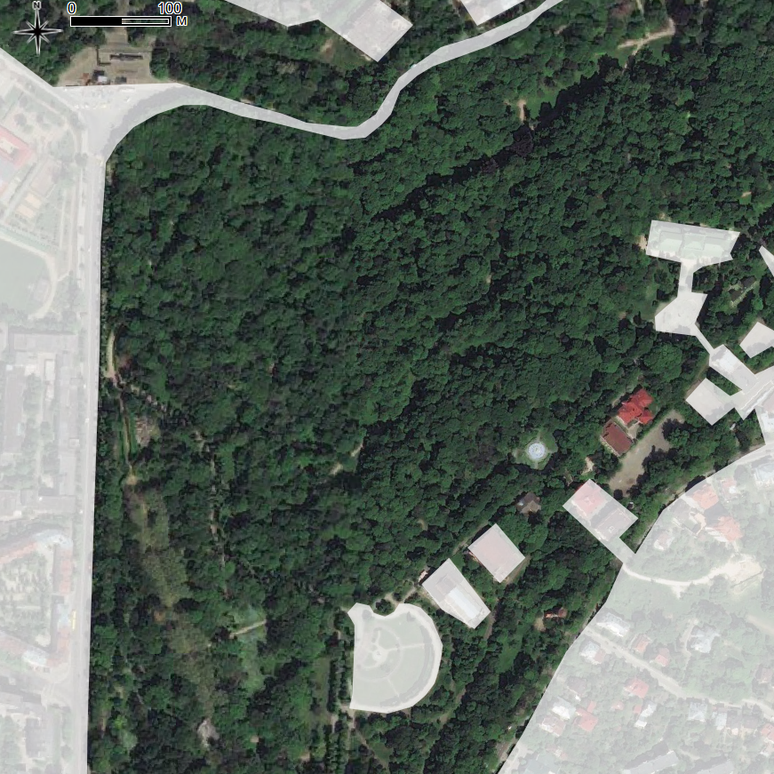

#### `ceme` --- Кладовища

Місця поховання із або без помітним лісовим покривом.

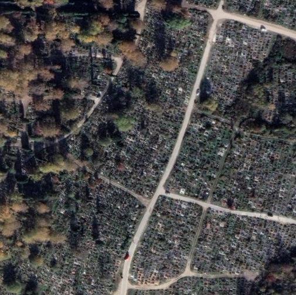

### Відкриті площі

#### `mead` --- Луки

Відкриті ділянки із лучною рослинністю без помітної деревної рослинності.

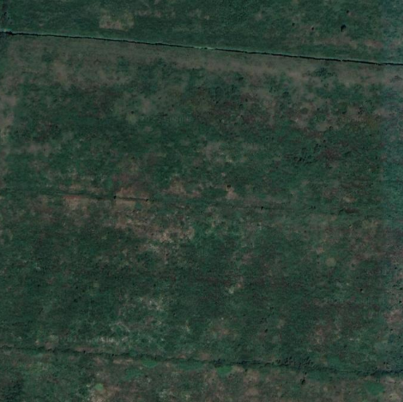

#### `agro` --- Агроценози

Значні площі засіяні, переважно, монокультурами сільськогосподарських рослин.

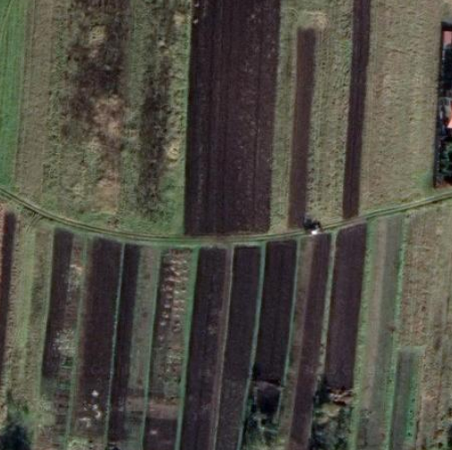

#### `rude` --- Рудеральні ділянки

Відкриті ділянки вкриті багаторічними самосівними рослинами або без рослинного покриву.

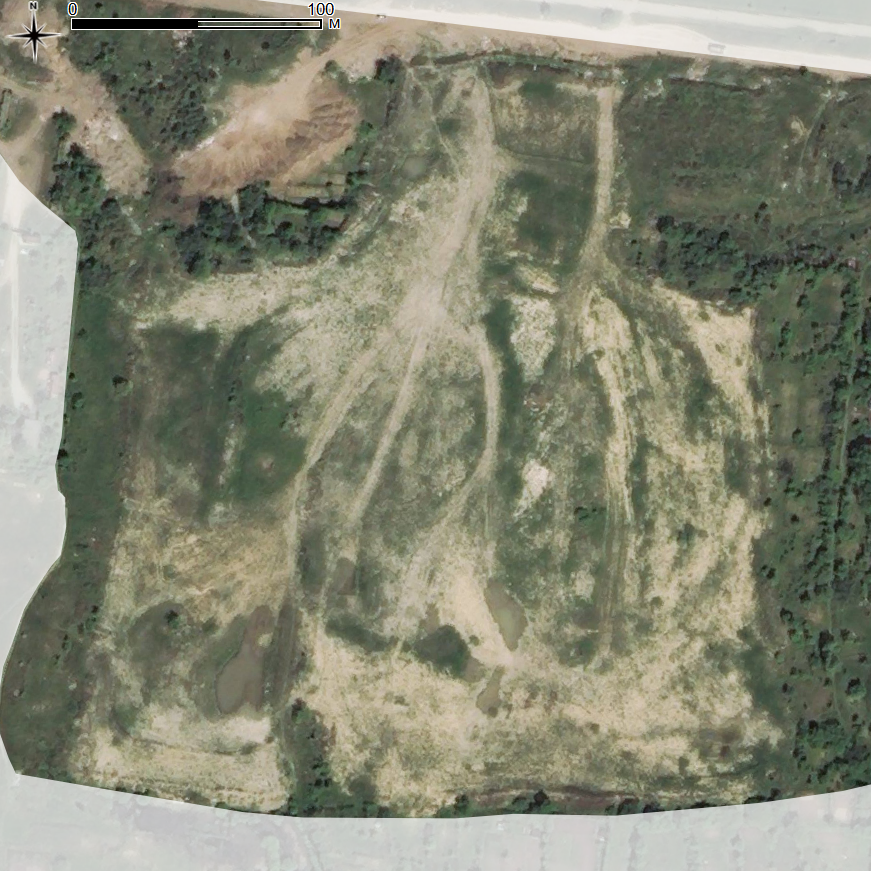

### Водно-болотні угіддя

#### `wade` -- Заболочені ділянки

Заболочені ділянки із незначними площами відкритої води, переважно, у вигляді меліораційних каналів.

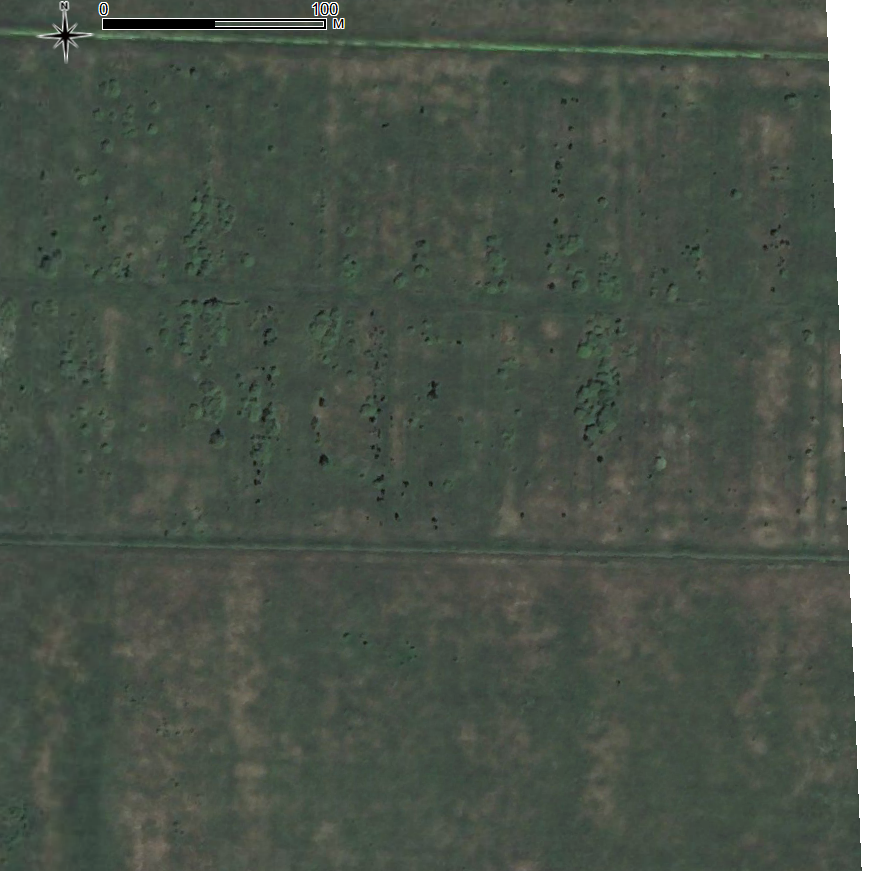

#### `wate` --- Відкрита вода

Відкриті водойми із або без суцільного покриву навколоводної рослинності.

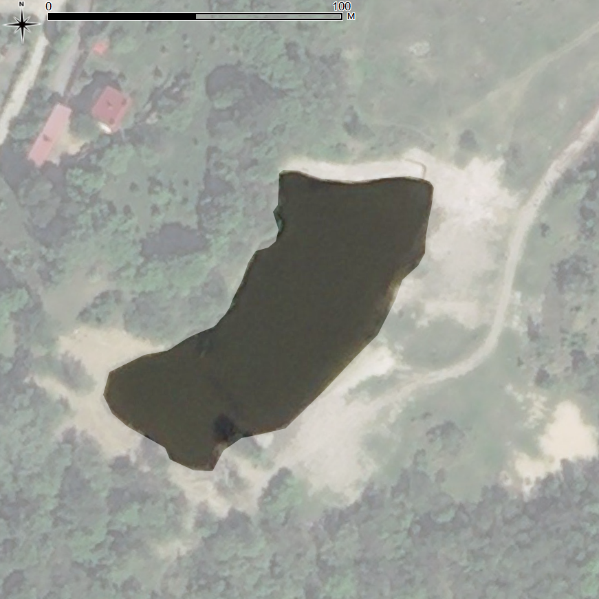

### Природні ліси

#### `fore` --- Ліси

Суцільні масиви старої лісової рослинності без помітної інфраструктури.

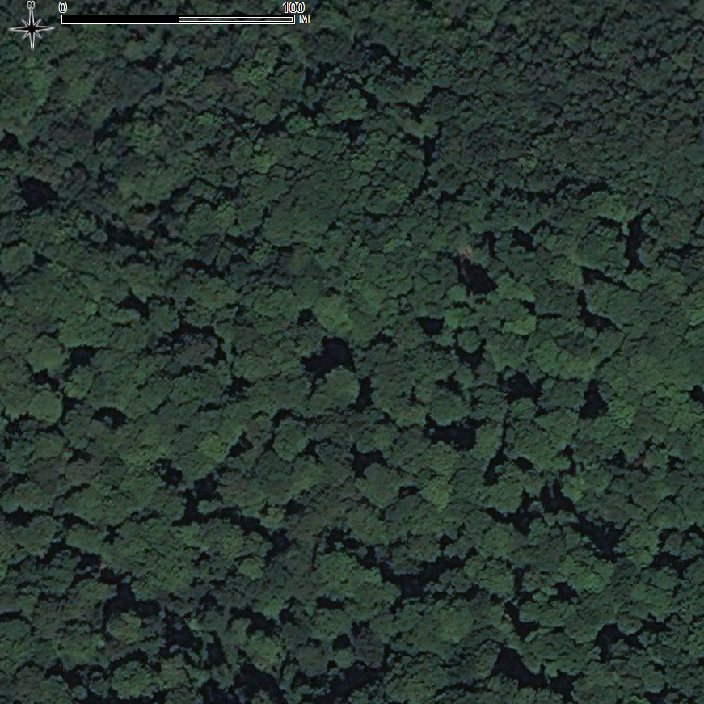
